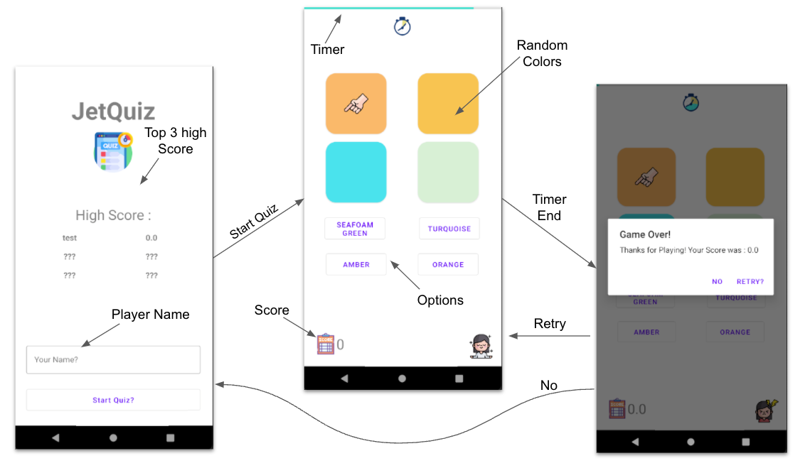

# Big Brain Kotlin : Application #1 - JetQuiz 
Sample application build for teaching basics of kotlin for Big-Brain-Kotlin Book

## features
- Name the colours correctly 
- Correct guess +1 score and wrong guess - 0.5 score
- When Score Reaches Zero Game Over
- Game Randomizes Each level 
- Leaderboard With Max Score

## Specs
- Grid of 4 Colours
- Grid for 4 Names

## :cop: License
Shield: [![CC BY-SA 4.0][cc-by-sa-shield]][cc-by-sa]

This work is licensed under a
[Creative Commons Attribution-ShareAlike 4.0 International License][cc-by-sa].

[![CC BY-SA 4.0][cc-by-sa-image]][cc-by-sa]

[cc-by-sa]: http://creativecommons.org/licenses/by-sa/4.0/
[cc-by-sa-image]: https://licensebuttons.net/l/by-sa/4.0/88x31.png
[cc-by-sa-shield]: https://img.shields.io/badge/License-CC%20BY--SA%204.0-lightgrey.svg

